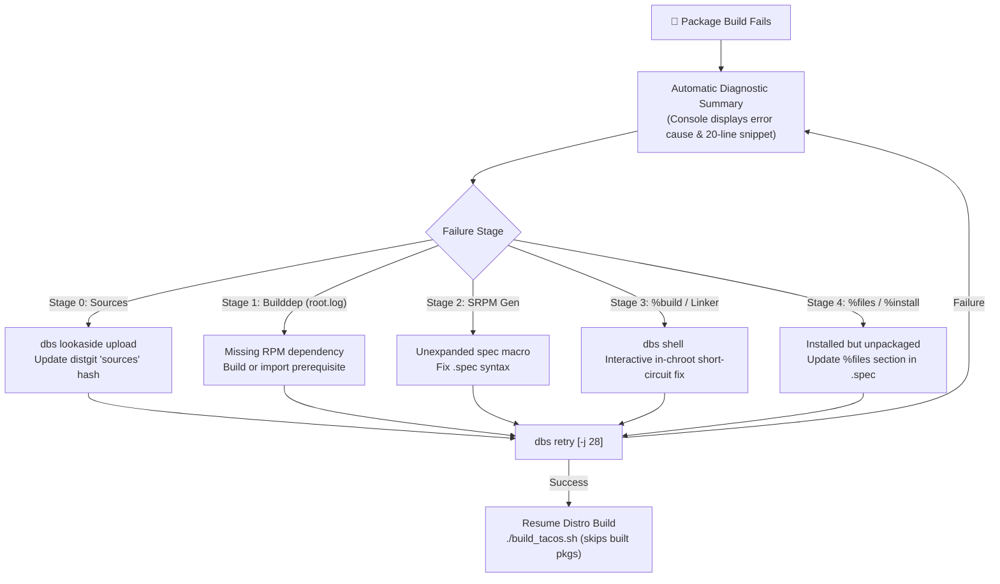

# TacOS / DBS Package Build Troubleshooting Guide

This guide provides end-to-end instructions, operational workflows, and diagnostic recipes for resolving package build failures within the **Distribution Build System (DBS)** when compiling the **TacOS** operating system.

---

## 1. Architecture & Diagnostic Workflow

DBS performs builds inside isolated, hermetic chroot environments powered by **Mock**. Every package compilation is assigned a dedicated worker and staging directory:

```
/srv/dbs/tacos/staging/worker-<worker_id>-<package>/
├── build.log        # Complete compiler, test, and rpmbuild transcript
├── root.log         # Chroot initialization and dnf5 dependency resolution log
├── dbs-runner.log   # DBS runner execution, Mock CLI invocations, and exit codes
├── state.log        # Mock execution state transitions and timestamps
└── *.rpm            # Binary and source RPM artifacts upon successful build
```

### The Rapid Failure Remediation Loop



---

## 2. DBS Diagnostic Toolset

### 2.1 Automated Build Failure Summary
When any package build fails (in `dbs build`, `dbs retry`, or `dbs distro build`), DBS automatically analyzes the logs and outputs a diagnostic banner:

```text
-----------------------------------------------------------
  Build Status:  FAILED
  Duration:      42.3s
  Log:           /srv/dbs/tacos/staging/worker-1-mypkg/build.log
  Failure:       mypkg.c:42:10: fatal error: header.h: No such file or directory [(%build)]
-----------------------------------------------------------
╔═══════════════════════════════════════════════════════════════════════════╗
║                   DBS BUILD FAILURE DIAGNOSTIC SUMMARY                   ║
╚═══════════════════════════════════════════════════════════════════════════╝
  Target:     mypkg
  Phase:      %build
  Log Source: /srv/dbs/tacos/staging/worker-1-mypkg/build.log
  Root Cause: mypkg.c:42:10: fatal error: header.h: No such file or directory [(%build)]

  >>> Diagnostic Log Excerpt (last 20 lines):
  │ make[1]: Entering directory '/builddir/build/BUILD/mypkg-1.0'
  │ gcc -O2 -g -c mypkg.c -o mypkg.o
  │ mypkg.c:42:10: fatal error: header.h: No such file or directory
  │    42 | #include <header.h>
  │       |          ^~~~~~~~~~
  │ compilation terminated.
  │ make[1]: *** [Makefile:120: mypkg.o] Error 1
  │ error: Bad exit status from /var/tmp/rpm-tmp.XYZ (%build)

  >>> Recommended Next Actions:
  • Inspect & debug interactively inside chroot: dbs shell mypkg
  • Retry build after edit:                     dbs retry mypkg
-----------------------------------------------------------
```

---

### 2.2 `dbs shell <pkg>`: Interactive In-Chroot Debugging

`dbs shell` drops you directly into the Mock chroot where the build failed. It:
1. **Auto-detects the worker extension** (`w1`, `w2`, etc.) from the staging directory.
2. **Auto-detects the working directory (`--cwd`)** pointing directly to `/builddir/build/BUILD/<pkg>-<version>/`.
3. **Preserves chroot state**: nothing is wiped, so you can test compilation in seconds.

```bash
# Drop into interactive bash shell in the build directory
dbs shell gcc

# Or specify a custom Mock profile or chroot directory
dbs shell gcc -r tacos-stable-x86_64

# Run a specific command inside the chroot directly
dbs shell gcc -- rpmbuild -bc --short-circuit /builddir/build/SPECS/gcc.spec
```

---

### 2.3 `dbs retry <pkg>`: Staging Cleanup & Isolated Rebuild

`dbs retry` cleans the previous failed worker staging directory (removing stale logs and incomplete artifacts) and re-runs the Mock compilation with `--force` enabled:

```bash
# Retry building gcc using full multi-threaded SMP (e.g. 28 cores)
dbs retry gcc -j 28

# Retry and clean the Mock chroot environment first
dbs retry gcc --clean-chroot -j 28

# Retry by pointing directly to a spec file
dbs retry /srv/dbs/tacos/rpm/vim/vim.spec
```

---

## 3. Failure Categories & Step-by-Step Recipes

### Category 0: Lookaside & Source Fetching Failures
* **Symptom:**
  ```text
  error: Bad file: .../archive.tar.gz: No such file or directory
  # Or:
  Lookaside download failed: 404 Not Found / SHA-512 hash mismatch
  ```
* **Diagnosis:** Mock cannot find the source archive in `/srv/dbs/tacos/rpm/<pkg>/` or the local lookaside cache (`/srv/dbs/lookaside`).
* **Recipe:**
  1. Inspect the package's `sources` file:
     ```bash
     cat /srv/dbs/tacos/rpm/<pkg>/sources
     # Example: SHA512 (zstd-1.5.7.tar.gz) = <hash>
     ```
  2. Upload the source archive into the DBS lookaside cache:
     ```bash
     dbs lookaside upload --file /path/to/zstd-1.5.7.tar.gz --pkg zstd
     ```
  3. Verify the file exists in the cache:
     ```bash
     dbs lookaside status
     ```
  4. Retry build:
     ```bash
     dbs retry zstd
     ```

---

### Category 1: Missing Build Dependencies (`root.log`)
* **Symptom:**
  ```text
  No match for argument: libsecret-devel >= 0.20
  Error: Problem: package cannot be installed
    - nothing provides libsecret-devel >= 0.20 needed by gnome-shell.spec
  ```
* **Diagnosis:** Mock's `dnf5 builddep` cannot satisfy one or more `BuildRequires` from the configured repositories.
* **Recipe:**
  1. Inspect `root.log`:
     ```bash
     tail -n 50 /srv/dbs/tacos/staging/worker-*-<pkg>/root.log
     ```
  2. Determine whether the missing dependency is part of TacOS or upstream Fedora ELN:
     * If part of TacOS: Ensure the package is built and published in `/srv/dbs/tacos/repo/x86_64/`.
     * If an upstream package: Verify the Mock repository URL in `mock/templates/tacos-stable-x86_64.tpl` is reachable.
  3. Build the missing prerequisite first:
     ```bash
     dbs build -j 28 libsecret
     ```
  4. Once `libsecret` publishes to the local repo, retry the dependent build:
     ```bash
     dbs retry gnome-shell -j 28
     ```

---

### Category 2: SRPM Generation & Unexpanded Spec Macros
* **Symptom:**
  ```text
  warning: line 12: Possible unexpanded macro in: Version: %{baseversion}.%{patchlevel}
  error: line 15: Empty tag: Version:
  ```
* **Diagnosis:** Mock executes `rpmbuild -bs` during Stage 1. If macros like `%{baseversion}` or `%{?version_override}` are not defined, RPM evaluation aborts.
* **Recipe:**
  1. Inspect the macro definition at the top of the `.spec` file:
     ```spec
     # Ensure fallback values are provided:
     %{!?baseversion: %global baseversion 9.1}
     %{!?patchlevel:  %global patchlevel 0}
     ```
  2. Or define system-wide macros in the Mock profile template (`mock/templates/tacos-stable-x86_64.tpl`):
     ```python
     config_opts['macros']['%dist'] = '.tcrs'
     config_opts['macros']['%_smp_mflags'] = '-j28'
     ```
  3. Reconcile package catalog:
     ```bash
     dbs db reconcile --path /srv/dbs/tacos/rpm
     ```
  4. Retry build:
     ```bash
     dbs retry <pkg>
     ```

---

### Category 3: Compilation, C/C++ & Linker Errors (`%build`)
* **Symptom:**
  ```text
  file.c:120:5: error: 'x' undeclared (first use in this function)
  make[2]: *** [Makefile:45: file.o] Error 1
  error: Bad exit status from /var/tmp/rpm-tmp.uV2Xq7 (%build)
  ```
* **Diagnosis:** Compilation failed inside the chroot during the `%build` phase.
* **Interactive Remediation Recipe:**
  1. Drop into the build environment:
     ```bash
     dbs shell <pkg>
     ```
  2. You will land directly in `/builddir/build/BUILD/<pkg>-<version>/`.
  3. Edit source files directly or run the compiler to reproduce:
     ```bash
     make -j28
     ```
  4. Test short-circuit compilation without re-unpacking or re-configuring:
     ```bash
     rpmbuild -bc --short-circuit /builddir/build/SPECS/<pkg>.spec
     ```
  5. Once the fix works, generate a patch file:
     ```bash
     diff -u file.c.orig file.c > /builddir/fix-build.patch
     exit
     ```
  6. Copy `/builddir/fix-build.patch` to `/srv/dbs/tacos/rpm/<pkg>/`, add `Patch0: fix-build.patch` to the `.spec` file, and retry:
     ```bash
     dbs retry <pkg> -j 28
     ```

#### Link-Time Optimization (LTO) & Heavy Linker Crashes
* If gcc/clang becomes unresponsive or runs out of memory during LTO linking (`lto-wrapper`):
  1. Add `%global _lto_cflags %{nil}` to `/srv/dbs/tacos/rpm/<pkg>/<pkg>.spec` to disable LTO for this package.
  2. Or configure SMP parallelism: `dbs retry <pkg> --smp 16`.

---

### Category 4: Test Suite Failures (`%check`)
* **Symptom:**
  ```text
  FAIL: test_network_connect
  make[2]: *** [Makefile:120: check-TESTS] Error 1
  error: Bad exit status from /var/tmp/rpm-tmp.XXXX (%check)
  ```
* **Diagnosis:** Mock runs builds in a hermetic container without external network access or specific hardware devices. Tests requiring network sockets, loopback interfaces, or audio hardware will fail.
* **Recipe:**
  1. In `/srv/dbs/tacos/rpm/<pkg>/<pkg>.spec`, check if a bcond exists:
     ```spec
     %bcond_with check
     # Or conditionalize failing tests:
     %if %{with check}
     %check
     make check || true
     %endif
     ```
  2. Retry build:
     ```bash
     dbs retry <pkg>
     ```

---

### Category 5: Packaging & Installation Failures (`%files`)
* **Symptom A: Installed (but unpackaged) files found:**
  ```text
  RPM build errors:
      Installed (but unpackaged) file(s) found:
         /usr/bin/new_tool
         /usr/share/man/man1/new_tool.1.gz
  ```
  * **Fix:** Add the files to `%files` in `<pkg>.spec`:
    ```spec
    %files
    %{_bindir}/new_tool
    %{_mandir}/man1/new_tool.1*
    ```
* **Symptom B: File listed twice / Directory owned twice:**
  * **Fix:** Use `%dir` for directory ownership, or remove redundant globs.
* **Symptom C: File not found:**
  ```text
  RPM build errors:
      File not found: /builddir/build/BUILDROOT/.../usr/lib64/libfoo.so
  ```
  * **Fix:** Verify if build options disabled that library or if the install destination changed. Test with:
    ```bash
    dbs shell <pkg> -- rpmbuild -bi --short-circuit /builddir/build/SPECS/<pkg>.spec
    ```

---

### Category 6: Distribution DAG & Circular Dependency Cycles
* **Symptom:**
  ```text
  Error: Circular dependency detected! Cannot schedule build order for: [gcc, glibc, systemd, ...]
  ```
* **Diagnosis:** Packages have mutual `BuildRequires` (e.g., Glibc requires GCC, GCC requires Glibc headers).
* **Recipe:**
  1. Enable DBS cycle breaker (severs feedback loops using base chroot fallback):
     ```bash
     dbs distro build tacos-stable-x86_64 --break-cycles
     ```
  2. Or segment builds into defined stages in `tacos-distro.toml`:
     ```toml
     [distro.stages]
     bootstrap = ["setup", "filesystem", "glibc", "binutils", "gcc"]
     system = ["bash", "coreutils", "systemd", "dnf5"]
     desktop = ["gnome-shell", "mutter", "wayland"]

     stage_order = ["bootstrap", "system", "desktop"]
     ```
  3. Build one stage at a time:
     ```bash
     dbs distro build tacos-stable-x86_64 --stage bootstrap --path /srv/dbs/tacos/rpm -j 28
     ```
  4. Resuming execution: DBS automatically checks `/srv/dbs/tacos/repo/x86_64/` and skips already completed packages, resuming from the first unbuilt package.

---

## 4. Interactive In-Chroot Command Cheat Sheet

When inside `dbs shell <pkg>`, use these short-circuit commands to test fixes instantly:

| Command | Action | Description |
| :--- | :--- | :--- |
| `rpmbuild -bp <spec>` | **Prep only** | Unpacks sources and applies all patches. |
| `rpmbuild -bc --short-circuit <spec>` | **Compile only** | Re-executes `%build` without re-extracting source tree. |
| `rpmbuild -bi --short-circuit <spec>` | **Install only** | Re-executes `%install` and checks `%files` without rebuilding. |
| `rpmbuild -ba --short-circuit <spec>` | **Create RPMs** | Packs binary and source RPMs if `%build` and `%install` succeeded. |
| `exit` (or `Ctrl+D`) | **Exit** | Leaves Mock chroot and returns to host shell. |

---

## 5. Summary of Recommended Daily Commands

```bash
# 1. Inspect failed package state
dbs pkg inspect <pkg>

# 2. Drop into interactive chroot to debug
dbs shell <pkg>

# 3. Clean worker staging and retry building single package with 28 cores
dbs retry <pkg> -j 28

# 4. Resume full distribution build (skips already built packages)
./build_tacos.sh
```
