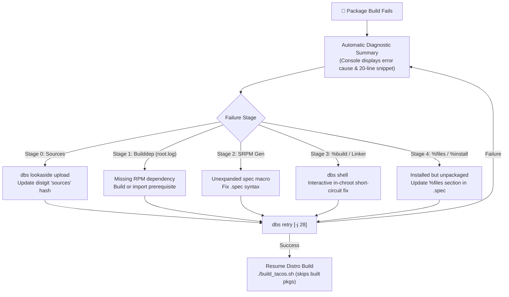

# TacOS / DBS Package Build Troubleshooting Guide

This guide provides end-to-end instructions, operational workflows, and diagnostic recipes for resolving package build failures within the **Distribution Build System (DBS)** when compiling the **TacOS** operating system.

---

## 1. Architecture & Diagnostic Workflow

DBS performs builds inside isolated, hermetic chroot environments powered by **Mock**. Every package compilation is assigned a dedicated worker and staging directory:

```
/srv/dbs/tacos/staging/worker-<worker_id>-<package>/
├── build.log        # Complete compiler, test, and rpmbuild transcript
├── root.log         # Chroot initialization and dnf5 dependency resolution log
├── dbs-runner.log   # DBS runner execution, Mock CLI invocations, and exit codes
├── state.log        # Mock execution state transitions and timestamps
└── *.rpm            # Binary and source RPM artifacts upon successful build
```

### The Rapid Failure Remediation Loop



---

## 2. DBS Diagnostic Toolset

### 2.1 Automated Build Failure Summary
When any package build fails (in `dbs build`, `dbs retry`, or `dbs distro build`), DBS automatically analyzes the logs and outputs a diagnostic banner:

```text
-----------------------------------------------------------
  Build Status:  FAILED
  Duration:      42.3s
  Log:           /srv/dbs/tacos/staging/worker-1-mypkg/build.log
  Failure:       mypkg.c:42:10: fatal error: header.h: No such file or directory [(%build)]
-----------------------------------------------------------
╔═══════════════════════════════════════════════════════════════════════════╗
║                   DBS BUILD FAILURE DIAGNOSTIC SUMMARY                   ║
╚═══════════════════════════════════════════════════════════════════════════╝
  Target:     mypkg
  Phase:      %build
  Log Source: /srv/dbs/tacos/staging/worker-1-mypkg/build.log
  Root Cause: mypkg.c:42:10: fatal error: header.h: No such file or directory [(%build)]

  >>> Diagnostic Log Excerpt (last 20 lines):
  │ make[1]: Entering directory '/builddir/build/BUILD/mypkg-1.0'
  │ gcc -O2 -g -c mypkg.c -o mypkg.o
  │ mypkg.c:42:10: fatal error: header.h: No such file or directory
  │    42 | #include <header.h>
  │       |          ^~~~~~~~~~
  │ compilation terminated.
  │ make[1]: *** [Makefile:120: mypkg.o] Error 1
  │ error: Bad exit status from /var/tmp/rpm-tmp.XYZ (%build)

  >>> Recommended Next Actions:
  • Inspect & debug interactively inside chroot: dbs shell mypkg
  • Retry build after edit:                     dbs retry mypkg
-----------------------------------------------------------
```

---

### 2.2 `dbs shell <pkg>`: Interactive In-Chroot Debugging

`dbs shell` drops you directly into the Mock chroot where the build failed. It:
1. **Auto-detects the worker extension** (`w1`, `w2`, etc.) from the staging directory.
2. **Auto-detects the working directory (`--cwd`)** pointing directly to `/builddir/build/BUILD/<pkg>-<version>/`.
3. **Preserves chroot state**: nothing is wiped, so you can test compilation in seconds.

```bash
# Drop into interactive bash shell in the build directory
dbs shell gcc

# Or specify a custom Mock profile or chroot directory
dbs shell gcc -r tacos-stable-x86_64

# Run a specific command inside the chroot directly
dbs shell gcc -- rpmbuild -bc --short-circuit /builddir/build/SPECS/gcc.spec
```

---

### 2.3 `dbs retry <pkg>`: Staging Cleanup & Isolated Rebuild

`dbs retry` cleans the previous failed worker staging directory (removing stale logs and incomplete artifacts) and re-runs the Mock compilation with `--force` enabled:

```bash
# Retry building gcc using full multi-threaded SMP (e.g. 28 cores)
dbs retry gcc -j 28

# Retry and clean the Mock chroot environment first
dbs retry gcc --clean-chroot -j 28

# Retry by pointing directly to a spec file
dbs retry /srv/dbs/tacos/rpm/vim/vim.spec
```

---

### 2.4 `dbs clean [pkg]`: Build Deletion & Repository Purge

`dbs clean` (aliases: `dbs delete-build`, `dbs purge`, `dbs build clean`, `dbs pkg clean`) removes build artifacts and resets package state without destroying package catalog metadata definitions:

1. **Worker Staging Cleanup:** Deletes `/srv/dbs/tacos/staging/worker-*-<pkg>/` directories, intermediate RPMs, and build logs.
2. **Repository Purge:** Deletes published `.rpm` and `.src.rpm` files for the target package from `/srv/dbs/tacos/distro/<arch>/` (including subpackages whose `SOURCERPM` originates from `<pkg>`).
3. **Repository Re-indexing:** Automatically executes `createrepo_c` to keep DNF repodata synchronized.
4. **Database Reset:** Deletes rows in `package_artifact` and resets `package.build_status` to `PENDING` (clearing duration, log paths, and error diagnostics).

```bash
# Purge all build artifacts (staging + repository RPMs) and reset DB state for a package
dbs clean gcc

# Options:
dbs clean gcc --staging-only    # Only clean worker staging logs & intermediate files (leaves repo RPMs intact)
dbs clean gcc --repo-only       # Only remove published RPMs from repo & run createrepo_c
dbs clean gcc --clean-chroot    # Also clean the Mock chroot profile (mock --clean)
dbs clean --all                 # Wipe all worker staging directories and reset all package build records
```

---

### 2.5 Comps Environments & Groups (`@workstation-product-environment`, `@core`)

DBS provides native support for Fedora / ELN / TacOS comps environments and groups everywhere in the CLI:

#### 1. Inspect Environments and Groups
Inspect constituent groups, package metrics (mandatory, default, optional), and check which packages are already present in your local dist-git repository (`/srv/dbs/tacos/rpm`) vs missing:
```bash
# Inspect the GNOME Workstation environment definition from KIWI config.xml
dbs comps inspect @workstation-product-environment -d /srv/dbs/tacos/rpm

# Inspect the Core system group
dbs comps inspect @core

# Inspect with XML element syntax directly from KIWI config.xml
dbs comps inspect '<package name="@workstation-product-environment"/>'
```

#### 2. Query & Export Comps Package Lists
```bash
# Output all mandatory and default package names in @core (one per line)
dbs comps list-packages @core

# Export packages from @workstation-product-environment missing locally in dist-git:
dbs comps list-packages @workstation-product-environment --missing-only -d /srv/dbs/tacos/rpm > missing_workstation_pkgs.txt

# List only packages already present in local dist-git:
dbs comps list-packages @workstation-product-environment --present-only -d /srv/dbs/tacos/rpm

# List all available comps environments and groups:
dbs comps list
dbs comps list --environments
dbs comps list --groups
```

#### 3. Build Directly by Indicating Environments or Groups
```bash
# Compile all member packages in @core using Mock:
dbs build @core -j 8

# Build the complete workstation product environment with DAG dependency ordering:
dbs distro build @workstation-product-environment

# Build from manifest files containing @<group> or KIWI <package name="@..."/> elements:
dbs distro build --packages tacos_package_list.txt
```

#### 4. Batch Clone or Retry Comps Targets
```bash
# Clone all packages belonging to a comps group from Fedora Rawhide:
dbs distgit clone @core

# Retry failed packages from a comps group:
dbs retry @core -j 8
```

#### 5. Using Comps Environments in Distribution Build Stages (`[distro.stages]`)
Comps environments and groups can be specified directly inside distribution stages in `tacos-distro.toml`:
```toml
[distro.stages]
bootstrap = ["filesystem", "glibc", "bash", "rpm", "dnf5"]
system = ["systemd", "util-linux", "pam", "openssl"]
workstation = [
    "@workstation-product-environment",
]
```
When running `dbs distro build` or `dbs distro build --stage workstation`, DBS will automatically:
1. Detect `@workstation-product-environment`.
2. Expand the environment and its constituent groups into member packages via DNF5 comps.
3. Discover all locally present member packages in the dist-git root (`/srv/dbs/tacos/rpm`).
4. Resolve their `.spec` files and schedule them into the topological DAG pipeline for that stage.
5. If `:nocheck` is appended (e.g. `"@workstation-product-environment:nocheck"`), all resolved member packages will automatically inherit `%check` test suite exemption.

#### 6. Downloading & Synchronizing Missing Comps Packages
When expanding a large comps target such as `@workstation-product-environment`, DBS checks which packages exist locally in your dist-git directory (`/srv/dbs/tacos/rpm`) and reports missing ones:
```text
✓ Expanded comps target '@workstation-product-environment' into 311 package(s)
Notice: Stage 'workstation': Comps target '@workstation-product-environment' resolved, but no member packages were found locally in /srv/dbs/tacos/rpm
```

To download all missing packages into your local repository:

##### Method A: Direct Comps Target Clone (Recommended)
`dbs distgit clone` natively accepts comps targets. It resolves all constituent packages, skips existing ones, and clones the missing repositories from the upstream distro preset (`fedora-rawhide` or `centos-stream-10`):
```bash
./bin/dbs -c tacos-distro.toml distgit clone @workstation-product-environment
```

##### Method B: Pipelined Clone for Missing-Only Packages (`--source`)
Export the exact missing source repository names using the `--source` (or `--src`) flag. This resolves binary subpackages (e.g. `intel-vsc-firmware`, `mesa-dri-drivers`) to their canonical dist-git repository names (`linux-firmware`, `mesa`), deduplicates them, and passes them cleanly to `distgit clone` without 404 errors or redundant clone attempts:
```bash
# 1. Export missing Source RPM repository list:
./bin/dbs -c tacos-distro.toml comps list-packages @workstation-product-environment --missing-only --source -d /srv/dbs/tacos/rpm > missing_workstation_srcs.txt

# 2. Batch-clone all missing source repositories:
cat missing_workstation_srcs.txt | xargs ./bin/dbs -c tacos-distro.toml distgit clone
```

##### Method C: Pre-fetch Upstream Source Tarballs into Lookaside
Once `.spec` and `sources` files are cloned, pre-fetch all upstream source archives into the lookaside cache in parallel so Mock workers start building without delays:
```bash
./bin/dbs -c tacos-distro.toml lookaside sync -j 16
```

#### 7. Avoiding False Positives for Subpackages (e.g. `intel-vsc-firmware`)
Comps environments specify binary subpackages (e.g. `intel-vsc-firmware`, `systemd-udev`), whereas dist-git repositories are organized by Source RPM names (e.g. `linux-firmware`, `systemd`).

Previously, checking `/srv/dbs/tacos/rpm` for `intel-vsc-firmware` would report it as missing even if `linux-firmware/linux-firmware.spec` was already cloned locally. DBS solves this via a two-tier resolution engine:
1. **Local Spec Subpackage Scanner:** Scans all `.spec` files in `/srv/dbs/tacos/rpm` and indexes `%package [-n] <name>`, `%package <subname>` (`%{name}-<subname>`), and `Provides:` capabilities. If a local `.spec` produces the subpackage, it is immediately marked as **present**.
2. **DNF5 SRPM Resolver:** For remaining candidate missing packages, queries `dnf5 repoquery --queryformat "%{name}|%{source_name}"`. If the parent source package (e.g. `linux-firmware`) is present locally, all its subpackages are treated as present.
3. **Canonical Clone Mapping:** If you run `dbs distgit clone intel-vsc-firmware`, DBS automatically detects that it is a subpackage of `linux-firmware` and clones the parent source git repository instead of failing with HTTP 404.
4. **Build Scheduling:** When `dbs distro build` resolves a subpackage (such as `intel-vsc-firmware`), it maps it directly to `linux-firmware/linux-firmware.spec` and ensures the spec is compiled once.

#### 8. Why Is Only One Package (e.g. `firefox`) Building in a Stage?
If `dbs distro build` or `dbs distro build --stage workstation` appears to only build a single package:
1. **Missing Local Clones:** DBS only compiles packages present locally in `/srv/dbs/tacos/rpm`. If other workstation packages haven't been cloned yet, DBS only schedules the ones that exist. Use `./bin/dbs comps list-packages @workstation-product-environment --present-only -d /srv/dbs/tacos/rpm` to verify what is present.
2. **Topological Layering (Kahn's BFS):** DBS compiles in layers based on `BuildRequires`. If a package is placed in a layer by itself (e.g. `Stage 'workstation' - Layer 0 (1 package(s))`), only 1 package will be built during that layer, even with `-j 16` concurrency. Subsequent layers start once that package finishes.
3. **Artifact Caching (`skip_existing = true`):** If other packages in the stage already succeeded in earlier stages or runs, DBS skips them (`✓ Layer package ... is already built (repository). Skipping.`), leaving only unbuilt packages to compile.
4. **Long Compilation Time:** Monolithic packages like `firefox` take 30–90+ minutes to build. Other fast packages in the same layer may have already finished in the first minute, leaving only the long-running package active.

---

### 2.6 Selective `%check` Test Exemptions (`nocheck_packages` & `:nocheck`)

Certain packages (`cockpit`, `git`, desktop GUI components) have upstream test suites that fail in headless, isolated Mock chroot environments because they expect physical hardware temperature sensors (`/sys/class/hwmon`), active display servers, real TTYs, or loopback network bindings.

Rather than disabling test suites globally with `--nocheck` (which would unsafely skip tests for `glibc`, `gcc`, `openssl`, and `systemd`), DBS supports granular exemptions:

#### 1. Configuration in `tacos-distro.toml`
Under the `[build]` table, list packages that should automatically skip `%check`:
```toml
[build]
skip_existing = true

# Packages that skip %check due to container/hardware constraints in Mock
nocheck_packages = [
    "cockpit",      # Requires host hardware temperature sensors (/sys/class/hwmon)
    "git",          # Requires real TTY and network loopback configuration
]
```

#### 2. Stage-Level `:nocheck` Syntax
In `[distro.stages]`, append `:nocheck` to any package name:
```toml
[distro.stages]
utilities = [
    "curl",
    "git:nocheck",
    "zstd",
    "cockpit:nocheck",
]
```

#### 3. CLI Command Overrides
Skip tests for specific packages during ad-hoc builds or retries:
```bash
# Retry with specific package exemptions:
dbs retry --file failed.txt --nocheck-pkg cockpit,git -j 16

# Build with selective exemptions:
dbs distro build --nocheck-pkg cockpit,git -j 8
```

---

## 3. Failure Categories & Step-by-Step Recipes

### Category 0: Lookaside & Source Fetching Failures
* **Symptom:**
  ```text
  error: Bad file: .../archive.tar.gz: No such file or directory
  # Or:
  Lookaside download failed: 404 Not Found / SHA-512 hash mismatch
  ```
* **Diagnosis:** Mock cannot find the source archive in `/srv/dbs/tacos/rpm/<pkg>/` or the local lookaside cache (`/srv/dbs/lookaside`).
* **Recipe:**
  1. Inspect the package's `sources` file:
     ```bash
     cat /srv/dbs/tacos/rpm/<pkg>/sources
     # Example: SHA512 (zstd-1.5.7.tar.gz) = <hash>
     ```
  2. Upload the source archive into the DBS lookaside cache:
     ```bash
     dbs lookaside upload --file /path/to/zstd-1.5.7.tar.gz --pkg zstd
     ```
  3. Verify the file exists in the cache:
     ```bash
     dbs lookaside status
     ```
  4. Retry build:
     ```bash
     dbs retry zstd
     ```

---

### Category 1: Missing Build Dependencies (`root.log`)
* **Symptom:**
  ```text
  No match for argument: libsecret-devel >= 0.20
  Error: Problem: package cannot be installed
    - nothing provides libsecret-devel >= 0.20 needed by gnome-shell.spec
  ```
* **Diagnosis:** Mock's `dnf5 builddep` cannot satisfy one or more `BuildRequires` from the configured repositories.
* **Recipe:**
  1. Inspect `root.log`:
     ```bash
     tail -n 50 /srv/dbs/tacos/staging/worker-*-<pkg>/root.log
     ```
  2. Determine whether the missing dependency is part of TacOS or upstream Fedora ELN:
     * If part of TacOS: Ensure the package is built and published in `/srv/dbs/tacos/repo/x86_64/`.
     * If an upstream package: Verify the Mock repository URL in `mock/templates/tacos-stable-x86_64.tpl` is reachable.
  3. Build the missing prerequisite first:
     ```bash
     dbs build -j 28 libsecret
     ```
  4. Once `libsecret` publishes to the local repo, retry the dependent build:
     ```bash
     dbs retry gnome-shell -j 28
     ```

---

### Category 2: SRPM Generation & Unexpanded Spec Macros
* **Symptom:**
  ```text
  warning: line 12: Possible unexpanded macro in: Version: %{baseversion}.%{patchlevel}
  error: line 15: Empty tag: Version:
  ```
* **Diagnosis:** Mock executes `rpmbuild -bs` during Stage 1. If macros like `%{baseversion}` or `%{?version_override}` are not defined, RPM evaluation aborts.
* **Recipe:**
  1. Inspect the macro definition at the top of the `.spec` file:
     ```spec
     # Ensure fallback values are provided:
     %{!?baseversion: %global baseversion 9.1}
     %{!?patchlevel:  %global patchlevel 0}
     ```
  2. Or define system-wide macros in the Mock profile template (`mock/templates/tacos-stable-x86_64.tpl`):
     ```python
     config_opts['macros']['%dist'] = '.tcrs'
     config_opts['macros']['%_smp_mflags'] = '-j28'
     ```
  3. Reconcile package catalog:
     ```bash
     dbs db reconcile --path /srv/dbs/tacos/rpm
     ```
  4. Retry build:
     ```bash
     dbs retry <pkg>
     ```

---

### Category 3: Compilation, C/C++ & Linker Errors (`%build`)
* **Symptom:**
  ```text
  file.c:120:5: error: 'x' undeclared (first use in this function)
  make[2]: *** [Makefile:45: file.o] Error 1
  error: Bad exit status from /var/tmp/rpm-tmp.uV2Xq7 (%build)
  ```
* **Diagnosis:** Compilation failed inside the chroot during the `%build` phase.
* **Interactive Remediation Recipe:**
  1. Drop into the build environment:
     ```bash
     dbs shell <pkg>
     ```
  2. You will land directly in `/builddir/build/BUILD/<pkg>-<version>/`.
  3. Edit source files directly or run the compiler to reproduce:
     ```bash
     make -j28
     ```
  4. Test short-circuit compilation without re-unpacking or re-configuring:
     ```bash
     rpmbuild -bc --short-circuit /builddir/build/SPECS/<pkg>.spec
     ```
  5. Once the fix works, generate a patch file:
     ```bash
     diff -u file.c.orig file.c > /builddir/fix-build.patch
     exit
     ```
  6. Copy `/builddir/fix-build.patch` to `/srv/dbs/tacos/rpm/<pkg>/`, add `Patch0: fix-build.patch` to the `.spec` file, and retry:
     ```bash
     dbs retry <pkg> -j 28
     ```

#### Link-Time Optimization (LTO) & Heavy Linker Crashes
* If gcc/clang becomes unresponsive or runs out of memory during LTO linking (`lto-wrapper`):
  1. Add `%global _lto_cflags %{nil}` to `/srv/dbs/tacos/rpm/<pkg>/<pkg>.spec` to disable LTO for this package.
  2. Or configure SMP parallelism: `dbs retry <pkg> --smp 16`.

#### "No space left on device" in Mock tmpfs (`%doc` / `%install`)
* **Symptom:**
  ```text
  cp: error copying '...': No space left on device
  /var/tmp/rpm-tmp.XXXX: line 43: unexpected EOF while looking for matching `''
  error: Bad exit status from /var/tmp/rpm-tmp.XXXX (%doc)
  error: Directory not found: /builddir/build/BUILD/<pkg>/BUILDROOT/usr/share/licenses/<pkg> [(%doc)]
  ```
* **Diagnosis:** Mock's default `tmpfs_enable = True` plugin mounts an in-memory RAM disk capped at 50% of physical RAM (e.g. 64 GB on a 128 GB machine). Massive packages (such as GCC with 3-stage bootstrap, full debuginfo, LTO objects, and libstdc++ HTML Doxygen documentation) exceed this limit at the final `%doc` or `%install` stage.
* **Remediation:**
  1. **Hot-Resize an Active In-Progress Build:**
     If a build is currently running and you don't want to lose hours of compilation progress, expand the tmpfs mount on the fly (requires sudo on host):
     ```bash
     sudo mount -o remount,size=100G /var/lib/mock/<profile>-<arch>-<uniqueext>/root
     ```
  2. **Permanent Fix (Disable tmpfs & Use High-Capacity NVMe):**
     In `mock/templates/tacos-stable-x86_64.tpl` (and `tacos-rolling.tpl`), disable `tmpfs_enable` and point Mock to high-capacity storage (such as `/srv/dbs/mock` on the 2.5TB NVMe drive):
     ```python
     config_opts['plugin_conf']['tmpfs_enable'] = False
     import os
     if os.path.exists('/srv/dbs/mock'):
         config_opts['basedir'] = '/srv/dbs/mock'
     ```

---

### Category 4: Test Suite Failures (`%check`)
* **Symptom:**
  ```text
  FAIL: test_network_connect
  make[2]: *** [Makefile:120: check-TESTS] Error 1
  error: Bad exit status from /var/tmp/rpm-tmp.XXXX (%check)
  ```
* **Diagnosis:** Mock runs builds in a hermetic container without external network access or specific hardware devices. Tests requiring network sockets, loopback interfaces, or audio hardware will fail.
* **Recipe:**
  1. In `/srv/dbs/tacos/rpm/<pkg>/<pkg>.spec`, check if a bcond exists:
     ```spec
     %bcond_with check
     # Or conditionalize failing tests:
     %if %{with check}
     %check
     make check || true
     %endif
     ```
  2. Retry build:
     ```bash
     dbs retry <pkg>
     ```

---

### Category 5: Packaging & Installation Failures (`%files`)
* **Symptom A: Installed (but unpackaged) files found:**
  ```text
  RPM build errors:
      Installed (but unpackaged) file(s) found:
         /usr/bin/new_tool
         /usr/share/man/man1/new_tool.1.gz
  ```
  * **Fix:** Add the files to `%files` in `<pkg>.spec`:
    ```spec
    %files
    %{_bindir}/new_tool
    %{_mandir}/man1/new_tool.1*
    ```
* **Symptom B: File listed twice / Directory owned twice:**
  * **Fix:** Use `%dir` for directory ownership, or remove redundant globs.
* **Symptom C: File not found:**
  ```text
  RPM build errors:
      File not found: /builddir/build/BUILDROOT/.../usr/lib64/libfoo.so
  ```
  * **Fix:** Verify if build options disabled that library or if the install destination changed. Test with:
    ```bash
    dbs shell <pkg> -- rpmbuild -bi --short-circuit /builddir/build/SPECS/<pkg>.spec
    ```

---

### Category 6: Distribution DAG & Circular Dependency Cycles
* **Symptom:**
  ```text
  Error: Circular dependency detected! Cannot schedule build order for: [gcc, glibc, systemd, ...]
  ```
* **Diagnosis:** Packages have mutual `BuildRequires` (e.g., Glibc requires GCC, GCC requires Glibc headers).
* **Recipe:**
  1. Enable DBS cycle breaker (severs feedback loops using base chroot fallback):
     ```bash
     dbs distro build tacos-stable-x86_64 --break-cycles
     ```
  2. Or segment builds into defined stages in `tacos-distro.toml`:
     ```toml
     [distro.stages]
     bootstrap = ["setup", "filesystem", "glibc", "binutils", "gcc"]
     system = ["bash", "coreutils", "systemd", "dnf5"]
     desktop = ["gnome-shell", "mutter", "wayland"]

     stage_order = ["bootstrap", "system", "desktop"]
     ```
  3. Build one stage at a time:
     ```bash
     dbs distro build tacos-stable-x86_64 --stage bootstrap --path /srv/dbs/tacos/rpm -j 28
     ```
  4. Resuming execution: DBS automatically checks `/srv/dbs/tacos/repo/x86_64/` and skips already completed packages, resuming from the first unbuilt package.

---

### Category 7: Local Repository Priority vs Upstream Mirrors (Librepo 404 / All Mirrors Were Tried)

* **Symptom:**
  ```text
  Building /srv/dbs/tacos/rpm/<target>/<target>.spec in Mock...
  -----------------------------------------------------------
    Build Status:  FAILED
    Failure:       Librepo error: Cannot download Packages/.../<dep>-<version>-<higher_rel>.fc46.x86_64.rpm: All mirrors were tried
  ```
  Even though `<dep>-<version>-<lower_rel>.tcrs.x86_64.rpm` has already been built and published in `/srv/dbs/tacos/distro/tacos-stable-x86_64/x86_64/`, Mock attempts to fetch a higher release from upstream Rawhide and fails because Rawhide mirror synchronization rapidly purges older builds.

* **Root Cause Analysis:**
  1. **EVR & DNF5 Priority Precedence:** In DNF5, `cost` (default: `1000`) is **strictly a tie-breaker** for identical Epoch-Version-Release packages. Because upstream Rawhide has a higher release number (e.g., `-4.fc46`) than the initial TacOS rebuild (e.g., `-1.tcrs`), DNF5 prefers the higher EVR unless repository `priority` is explicitly set.
  2. **Mock Template Repository Configuration:** By default, Mock's chroot template only included `[fedora]` pointing to Rawhide. Neither the dynamic staging repository nor the published local TacOS repository were configured with priority.
  3. **Mirror Eviction:** Fedora Rawhide packages roll rapidly. Once Koji builds a newer revision, older packages are deleted from mirror storage within hours. Repodata caches referencing the evicted RPM return HTTP 404 from all mirrors.

* **Permanent Resolution:**
  1. **Mock Profile Priority Hierarchy:**
     Configure repositories in Mock chroot templates (`mock/templates/tacos-stable-x86_64.tpl` and `tacos-rolling.tpl`) with explicit DNF5 priority:
     ```ini
     [tacos-staging]
     name=TacOS Dynamic Staging Repository
     baseurl=file:///srv/dbs/tacos/staging/rpms/{{ target_arch }}
     enabled=1
     gpgcheck=0
     metadata_expire=0
     cost=1
     priority=1
     skip_if_unavailable=1

     [tacos-local]
     name=TacOS Local Build Repository
     baseurl=file:///srv/dbs/tacos/distro/tacos-stable-x86_64/{{ target_arch }}
     enabled=1
     gpgcheck=0
     metadata_expire=0
     cost=1
     priority=2
     skip_if_unavailable=1

     [fedora]
     name=Fedora Rawhide
     metalink=https://mirrors.fedoraproject.org/metalink?repo=rawhide&arch=$basearch
     gpgcheck=0
     enabled=1
     priority=99
     ```
  2. **DBS Automatic Local Repo Injection:**
     DBS automatically resolves the published distro directory (`<dest>/<name>/<arch>`) and dynamically wires it into `MockRunner` (`--addrepo=file://...`) across `dbs build`, `dbs retry`, and `dbs distro build`.
  3. **Re-indexing Local Repository:**
     If new packages are manually copied to the distro repository, ensure repodata metadata is refreshed:
     ```bash
     createrepo_c --update /srv/dbs/tacos/distro/tacos-stable-x86_64/x86_64
     ```

---

## 4. Interactive In-Chroot Command Cheat Sheet

When inside `dbs shell <pkg>`, use these short-circuit commands to test fixes instantly:

| Command | Action | Description |
| :--- | :--- | :--- |
| `rpmbuild -bp <spec>` | **Prep only** | Unpacks sources and applies all patches. |
| `rpmbuild -bc --short-circuit <spec>` | **Compile only** | Re-executes `%build` without re-extracting source tree. |
| `rpmbuild -bi --short-circuit <spec>` | **Install only** | Re-executes `%install` and checks `%files` without rebuilding. |
| `rpmbuild -ba --short-circuit <spec>` | **Create RPMs** | Packs binary and source RPMs if `%build` and `%install` succeeded. |
| `exit` (or `Ctrl+D`) | **Exit** | Leaves Mock chroot and returns to host shell. |

---

## 5. Summary of Recommended Daily Commands

```bash
# 1. Inspect failed package state
dbs pkg inspect <pkg>

# 2. Drop into interactive chroot to debug
dbs shell <pkg>

# 3. Clean worker staging and retry building single package with 28 cores
dbs retry <pkg> -j 28

# 4. Resume full distribution build (skips already built packages)
./build_tacos.sh

# 5. Bulk promote (BTRFS CoW), GPG sign, and index all finished packages into public distro
make distro-publish
```
