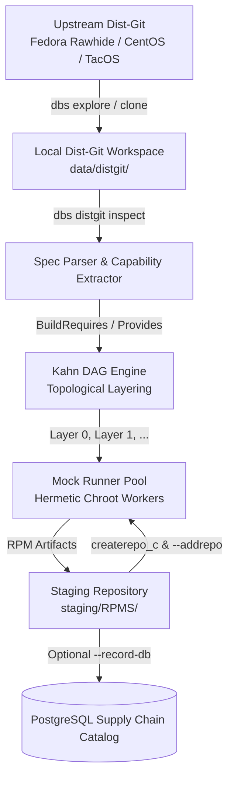

# DBS (Distribution Build System) - Hands-On Tutorial

Welcome to the hands-on tutorial for the **Distribution Build System (DBS)**. This guide provides a step-by-step walkthrough covering everything from initial compilation and dist-git repository exploration to hermetic Mock chroot builds and topological dependency orchestration using Kahn's algorithm.

---

## Table of Contents

1. [Architecture & Concepts](#1-architecture--concepts)
2. [Prerequisites & System Setup](#2-prerequisites--system-setup)
3. [Building & Verifying DBS](#3-building--verifying-dbs)
4. [Exploring Upstream Dist-Git Repositories](#4-exploring-upstream-dist-git-repositories)
5. [Cloning, Re-branding, and Remote Management](#5-cloning-re-branding-and-remote-management)
6. [Inspecting Package Metadata & Spec Files](#6-inspecting-package-metadata--spec-files)
7. [Dependency Analysis with Kahn's DAG Engine](#7-dependency-analysis-with-kahns-dag-engine)
8. [Hermetic Compilation with Mock](#8-hermetic-compilation-with-mock)
9. [Automated Layered Build Pipeline](#9-automated-layered-build-pipeline)
10. [Supply Chain Database Tracking (Optional)](#10-supply-chain-database-tracking-optional)
11. [Troubleshooting & Best Practices](#11-troubleshooting--best-practices)

---

## 1. Architecture & Concepts

Traditional Linux distribution build systems often rely on complex, brittle shell scripts or vendor-locked infrastructure. DBS replaces this with a modern, modular architecture written in Rust:



### Key Concepts
* **Dist-Git:** A Git repository storing RPM `.spec` files, custom patches, and file metadata (`sources` file containing hashes for lookaside cache archives).
* **Lookaside Cache:** An HTTP server storing large source tarballs referenced by dist-git repositories.
* **Topological Layers (Kahn's Algorithm):** An in-degree BFS scheduling algorithm that partitions workspace packages into discrete, parallelizable compilation layers. Layer 0 packages have zero workspace dependencies; Layer $N+1$ packages only depend on packages compiled in earlier layers.
* **Hermetic Mock Runner:** A build engine executing in isolated chroots (`/var/lib/mock/`) with clean package sets, preventing contamination between the host system and the build environment.
* **Dynamic Local Repository Feedback:** As packages finish compiling, DBS automatically indexes the output RPMs using `createrepo_c` and passes `--addrepo=file://...` to subsequent Mock workers so downstream dependencies resolve seamlessly.

---

## 2. Prerequisites & System Setup

Ensure your host system (Fedora, CentOS Stream, TacOS, or RHEL) has the necessary tools:

```bash
# Install packaging and build tools
sudo dnf install -y rust cargo mock createrepo_c git

# Grant your user permission to run Mock without sudo
sudo usermod -a -G mock $USER

# Apply the new group membership to the current shell
newgrp mock
```

Verify that Mock functions properly:

```bash
mock --version
```

---

## 3. Building & Verifying DBS

Clone the DBS repository and compile the release binary:

```bash
git clone https://codeberg.org/imcsk8/dbs.git
cd dbs

# Compile the optimized release binary
make release
```

The compiled binary will be placed at `./bin/dbs`. Verify the CLI:

```bash
./bin/dbs --help
```

You will see the main command options:
* `explore`: Search packages across upstream dist-git platforms.
* `distgit`: Clone, pull, sync, and inspect dist-git repositories.
* `dag`: Analyze dependencies and compute topological build layers.
* `build`: Compile packages using Mock or rpmbuild.
* `os`: Manage operating system presets and database definitions.
* `pkg`: Query packages in the PostgreSQL catalog.

---

## 4. Exploring Upstream Dist-Git Repositories

DBS allows you to query dist-git platforms remotely using their native APIs (Pagure for Fedora, GitLab for CentOS Stream, Forgejo for TacOS/Codeberg).

### Search Fedora Rawhide (Pagure API)

```bash
./bin/dbs explore --distro fedora-rawhide --search zstd
```

Output:
```text
=== Exploring distro: Fedora Rawhide (search: "zstd", limit: 25) ===
Found 2 packages:
  • zstd
    Clone URL: https://src.fedoraproject.org/rpms/zstd.git
  • zstd-jni
    Clone URL: https://src.fedoraproject.org/rpms/zstd-jni.git
```

### Search CentOS Stream 10 (GitLab API)

```bash
./bin/dbs explore --distro centos-stream-10 --search python --limit 5
```

---

## 5. Cloning, Re-branding, and Remote Management

When maintaining a downstream distribution (like TacOS), you frequently need to clone packages from Fedora Rawhide, rename or rebrand them, and push them to your own Git forge (such as Codeberg or GitHub).

### Scenario A: Direct Dist-Git Clone

Clone the `zstd` package repository directly from Fedora Rawhide:

```bash
./bin/dbs distgit clone --distro fedora-rawhide zstd
```

This clones `https://src.fedoraproject.org/rpms/zstd.git` into `data/distgit/zstd`.

### Scenario B: Clone and Retarget Remotes (`--new-origin`)

When creating a package for your own distribution, point `origin` to your repository while keeping the upstream Fedora repository tracked as `upstream`:

```bash
./bin/dbs distgit clone --distro fedora-rawhide zstd \
  --new-origin https://codeberg.org/imcsk8/tacos/zstd.git
```

Check the configured git remotes:

```bash
git -C data/distgit/zstd remote -v
```

Output:
```text
origin    https://codeberg.org/imcsk8/tacos/zstd.git (fetch)
origin    https://codeberg.org/imcsk8/tacos/zstd.git (push)
upstream  https://src.fedoraproject.org/rpms/zstd.git (fetch)
upstream  https://src.fedoraproject.org/rpms/zstd.git (push)
```

### Scenario C: Re-branding a Package (`--as` and `--rename-spec`)

To fork and rebrand an upstream package (e.g. `fedora-release` into `tacos-release`):

```bash
./bin/dbs distgit clone --distro fedora-rawhide fedora-release \
  --as tacos-release \
  --rename-spec \
  --new-origin https://codeberg.org/imcsk8/tacos/tacos-release.git
```

This will:
1. Clone `fedora-release` into `data/distgit/tacos-release`.
2. Rename `fedora-release.spec` to `tacos-release.spec`.
3. Set `origin` to `https://codeberg.org/imcsk8/tacos/tacos-release.git` and `upstream` to Fedora.

---

## 6. Inspecting Package Metadata & Spec Files

DBS includes a native RPM `.spec` parser that extracts Package Name, Epoch, Version, Release, License, Sources, Patches, `BuildRequires`, and `Requires`.

Inspect the cloned `zstd` package:

```bash
./bin/dbs distgit inspect data/distgit/zstd/zstd.spec
```

Sample output:
```text
=== Spec Metadata: zstd ===
  File: data/distgit/zstd/zstd.spec
  Version: 1.5.7, Release: 2%{?dist}
  Summary: Zstandard - Fast real-time compression algorithm
  License: BSD and GPLv2
  Sources (1):
    - https://github.com/facebook/zstd/releases/download/v1.5.7/zstd-1.5.7.tar.gz
  Patches (0):
  BuildRequires (7):
    - /usr/bin/valgrind
    - cmake
    - gcc
    - gtest-devel
    - ninja-build
    - pkgconfig(liblz4)
    - pkgconfig(liblzma)
  Requires (1):
    - libzstd%{?_isa} = %{version}-%{release}
```

---

## 7. Dependency Analysis with Kahn's DAG Engine

When compiling multiple interdependent packages, you must determine the correct compilation order. DBS uses **Kahn's in-degree BFS algorithm** to group packages into parallel compilation layers.

### Clone Multiple Interdependent Packages

Clone a small set of interdependent packages:

```bash
./bin/dbs distgit clone --distro fedora-rawhide lz4 zstd xxhash
```

### Analyze the Dependency Graph

Run the DAG solver over the `data/distgit` directory:

```bash
./bin/dbs dag -i data/distgit
```

Example output:
```text
Parsed 3 package spec files from "data/distgit".

Topological Build Order (3 packages across 2 layers):

  Layer 0 (2 packages - can build concurrently):
    • lz4
    • xxhash

  Layer 1 (1 packages - can build concurrently):
    • zstd (depends on: lz4)
```

### Generate a Markdown Dependency Report

Export a comprehensive report documenting the build order and dependencies:

```bash
./bin/dbs dag -i data/distgit --report reports/dag_plan.md
```

Inspect `reports/dag_plan.md` to see:
* Layer-by-layer build tables.
* Full package dependency breakdown (`BuildRequires` vs. workspace providers).
* Circular dependency diagnostics (if cycles exist, packages are flagged with their unresolved dependencies).

---

## 8. Hermetic Compilation with Mock & Custom Chroot Profiles

Mock provides clean chroot environments using DNF/RPM. It isolates the build process from the host system.

DBS provides native support for discovering, validating, and compiling packages using **custom distribution chroot profiles** (such as `tacos-rolling-x86_64.cfg` with nested templates from `/home/imcsk8/projects/gemini-workdir/tacos/mock`).

### Discovering & Validating Chroots

Discover all available chroots across workspace `./mock`, project paths (`../tacos/mock`), and user configs:

```bash
./bin/dbs chroot list
```

Inspect the parsed configuration and verify all nested template includes (`include('templates/tacos-rolling.tpl')`):

```bash
./bin/dbs chroot inspect tacos-rolling-x86_64
```

Validate that Mock can initialize the buildroot successfully:

```bash
./bin/dbs chroot check tacos-rolling-x86_64
```

### Compiling with Custom Chroots

You can specify a chroot using either:
1. **Its profile name:** DBS automatically searches `./mock`, `../tacos/mock`, and system paths:
   ```bash
   ./bin/dbs build -r tacos-rolling-x86_64 -o staging data/distgit/lz4/lz4.spec
   ```
2. **A direct file path:** DBS automatically extracts the parent directory as the Mock `--configdir` so all included templates resolve properly:
   ```bash
   ./bin/dbs build -r /home/imcsk8/projects/gemini-workdir/tacos/mock/tacos-rolling-x86_64.cfg \
     -o staging data/distgit/lz4/lz4.spec
   ```

### Importing or Scaffolding New Chroots

To import an external chroot configuration and its `templates/` folder into your DBS workspace:

```bash
./bin/dbs chroot add /home/imcsk8/projects/gemini-workdir/tacos/mock/tacos-rolling-x86_64.cfg
```

To scaffold a clean starter template for a new distribution:

```bash
./bin/dbs chroot init my-distribution-x86_64 --arch x86_64
```

### Inspecting Built Artifacts

During compilation, DBS will:
1. Run `mock --buildsrpm` to produce a source RPM (`.src.rpm`).
2. Run `mock --rebuild` inside the hermetic chroot.
3. Extract generated binary RPMs (`.rpm`) and build logs (`build.log`, `root.log`) into `staging/RPMS/` and `staging/logs/`.
4. Index `staging/RPMS/` using `createrepo_c`.

```bash
ls -la staging/RPMS/
ls -la staging/logs/
```

---

## 9. Automated Layered Build Pipeline

Instead of manually building each package, DBS can orchestrate the entire topological DAG automatically.

### Running Layered Builds

```bash
./bin/dbs dag -i data/distgit --build -r fedora-rawhide-x86_64 -j 4 -o staging
```

### How the Layered Execution Works:
1. **Layer 0 Execution:** `lz4` and `xxhash` have no intra-workspace dependencies. Mock workers build them concurrently up to the worker limit (`-j 4`).
2. **Repository Re-Indexing:** Upon Layer 0 completion, DBS indexes `staging/RPMS/` with `createrepo_c`.
3. **Layer 1 Execution:** `zstd` requires `lz4`. When compiling `zstd`, DBS passes `--addrepo=file://<abs_path>/staging/RPMS` to Mock. Mock installs the newly compiled `lz4-devel` RPM from Layer 0.
4. **Completion:** All packages are hermetically built in exact dependency order with zero host contamination.

---

## 10. Supply Chain Database Tracking (Optional)

DBS includes an optional relational database schema (backed by PostgreSQL and Diesel) for tracking operating systems, packages, source commits, capabilities, and build artifacts.

### Start the Database Container

```bash
# Start the local PostgreSQL container
make db

# Apply Diesel database migrations
make bootstrap
```

### Synchronize Packages and Record to Database

```bash
./bin/dbs distgit sync --distro fedora-rawhide --search zstd --limit 5 --record-db
```

### Query Database Records

```bash
# List tracked operating systems
./bin/dbs os list

# List recorded packages
./bin/dbs pkg list
```

---

## 11. Maintaining the Dist-Git Lookaside Cache (BTRFS CoW)

In dist-git workflows, large source archives (tarballs, upstream zip archives) are deliberately excluded from Git tracking. Instead, packages maintain a `sources` manifest containing SHA-512 hashes.

DBS includes a native, storage-efficient **Content-Addressable Storage (CAS)** lookaside manager (`dbs lookaside`) with deep BTRFS Copy-on-Write (`FICLONE` ioctl) integration.

### Recommended BTRFS Storage Architecture & Setup

While DBS is filesystem-agnostic and functions transparently on Ext4, XFS, tmpfs, and ZFS via automatic hardlink and copy fallbacks, using **BTRFS** unlocks significant enterprise performance and storage advantages:

1. **Kernel `FICLONE` Copy-on-Write Reflinks**: Staging gigabytes of source tarballs into Mock chroots takes **0.001 seconds** and consumes **0 additional bytes** of disk space until files are modified.
2. **Transparent Zstandard Compression**: Files like patches, firmware, and uncompressed archives compress on the fly with near-zero CPU overhead.
3. **Out-of-Band Block Deduplication**: Identical 128KB blocks shared between minor package versions (e.g. `zstd-1.5.6` and `zstd-1.5.7`) share underlying storage extents.
4. **Subvolume Isolation & Atomic Replication**: Snapshots can be sent to remote build mirrors via `btrfs send | btrfs receive`.

#### Step 1: Create the Dedicated Lookaside Subvolume

```bash
# Create parent directory
sudo mkdir -p /srv/dbs

# Create the dedicated BTRFS subvolume
sudo btrfs subvolume create /srv/dbs/lookaside
```

#### Step 2: Configure Mount Options in `/etc/fstab`

To ensure transparent compression and fast disk I/O, configure the subvolume mount in `/etc/fstab`:

```text
# Dedicated BTRFS lookaside mount with zstd compression and fast access
UUID=<disk-uuid>  /srv/dbs/lookaside  btrfs  subvol=@lookaside,compress=zstd:3,noatime,space_cache=v2  0 0
```

> [!TIP]
> **Reflink Boundary Rule:** Linux `FICLONE` system calls only succeed when the source (lookaside cache) and destination (package staging/build tree) reside on the **same BTRFS filesystem pool**. Keeping `/srv/dbs/lookaside` and `data/distgit` (or your build workspaces) within the same BTRFS filesystem guarantees 100% zero-cost CoW staging.

#### Step 3: Set Ownership & Permissions

Ensure your development user and the `mock` build group have read and write permissions:

```bash
sudo chown -R $USER:mock /srv/dbs/lookaside
sudo chmod 2775 /srv/dbs/lookaside
```

#### Step 4: Advanced BTRFS Maintenance & Optimization

* **Force Zstandard Compression on Existing Archives:**
  ```bash
  sudo btrfs filesystem defragment -r -czstd:3 /srv/dbs/lookaside
  ```

* **Deduplicate Duplicate Blocks with `duperemove`:**
  ```bash
  sudo dnf install -y duperemove
  sudo duperemove -drh /srv/dbs/lookaside
  ```

* **Create Read-Only Atomic Snapshots for Backups or Mirroring:**
  ```bash
  sudo btrfs subvolume snapshot -r /srv/dbs/lookaside /srv/dbs/lookaside-snap-$(date +%Y%m%d)
  # Stream snapshot incrementally to a remote mirror:
  # sudo btrfs send /srv/dbs/lookaside-snap-... | ssh mirror "sudo btrfs receive /srv/dbs/lookaside"
  ```

### Inspecting Lookaside Metrics & BTRFS Engine

Check cache capacity, deduplicated archives, and filesystem features:

```bash
./bin/dbs lookaside status
```

Output:
```text
===========================================================
 DBS Dist-git Lookaside Status & Storage Metrics
===========================================================
 Root Directory:        /srv/dbs/lookaside
 Filesystem Engine:     BTRFS (Reflinks & CoW Compression Active)
 CAS Unique Archives:   42
 CAS Physical Storage:  312.45 MB (0.30 GB)
 Distinct Packages:     28
 Dist-git Exposed Files:42

💡 BTRFS Storage Optimizations:
  * CoW Reflinks:        Enabled (0 disk overhead for staged packages)
  * Force Compression:   btrfs filesystem defragment -r -czstd:3 /srv/dbs/lookaside
  * Block Deduplication: duperemove -drh /srv/dbs/lookaside
===========================================================
```

### Uploading a Source Archive

When adding a new upstream version or creating a package, upload the tarball into lookaside:

```bash
./bin/dbs lookaside upload \
  --pkg zstd \
  --file /tmp/zstd-1.5.7.tar.gz \
  --spec data/distgit/zstd/zstd.spec
```

This will:
1. Stream-compute the SHA-512 hash (`8ce01b...`).
2. Store the file once in Content-Addressable Storage (`.cas/sha512/8c/8ce01b...`).
3. Create a zero-cost BTRFS reflink in the public dist-git path (`pkgs/zstd/zstd-1.5.7.tar.gz/sha512/8ce01b.../zstd-1.5.7.tar.gz`).
4. Update the package's dist-git `sources` manifest file with:
   `SHA512 (zstd-1.5.7.tar.gz) = 8ce01b...`

### Bulk Pre-fetching Dist-Git Sources

Pre-fetch all declared tarballs across your local dist-git repositories directly into the lookaside cache:

```bash
./bin/dbs lookaside sync -i data/distgit -j 4
```

### Pruning Orphaned Tarballs (Garbage Collection)

Detect and clean up archives in the CAS storage that are no longer referenced by any dist-git `sources` manifest:

```bash
# Preview unreferenced archives without deleting:
./bin/dbs lookaside gc --dry-run --distgit data/distgit

# Safely prune orphaned files to reclaim disk space:
./bin/dbs lookaside gc --distgit data/distgit
```

### Zero-Disk Staging During Builds

When building packages (`dbs build` or `dbs dag --build`), DBS checks the lookaside cache before attempting network downloads. If found, it creates a **BTRFS CoW reflink** (`FICLONE`) directly into Mock's `SOURCES/` directory:
- **Duration:** 0.001 seconds
- **Disk Usage:** 0 extra bytes (shared data extents until modified)

---

## 12. Troubleshooting & Best Practices

### Mock Permissions
* **Issue:** `mock: error: Cannot find user in mock group`
* **Solution:** Run `sudo usermod -a -G mock $USER` and open a new login shell or execute `newgrp mock`.

### Clean Chroot Caches
* If you want to reset Mock's chroot cache to ensure a fresh baseline:
  ```bash
  mock -r fedora-rawhide-x86_64 --clean
  ```

### Lookaside Tarballs
* If a package requires external source archives not committed to Git, download them using `spectool` or run:
  ```bash
  ./bin/dbs distgit sync --distro fedora-rawhide --sources
  ```

### Workspace Cleanup
* To clean staging directories and build artifacts:
  ```bash
  make clean
  ```

---

## Next Steps

* Explore [AGENTS.md](file:///home/imcsk8/projects/gemini-workdir/dbs/AGENTS.md) for technical architecture details and developer guidelines.
* Check [README.md](file:///home/imcsk8/projects/gemini-workdir/dbs/README.md) for quick command references and project overview.
* Review the source code in [`rust/src/main.rs`](file:///home/imcsk8/projects/gemini-workdir/dbs/rust/src/main.rs) and [`rust/src/dag/mod.rs`](file:///home/imcsk8/projects/gemini-workdir/dbs/rust/src/dag/mod.rs).
